# Responsive Design in Figma

https://youtu.be/tJCv91c6Krk?si=W37OdMjQgvZ4Khma

Chat prompts:

Write this text word by word using markdown format, dividing all its parts with h4 tags, using bullet points for all its sentences, using backticks for editing, and shortcuts terminology:

can you list all the shortcuts mention?

### **=>** Intro

- `Responsive design` can be both tricky and overwhelming.
- What device sizes should I use?
- How should text and spacing change between devices?
- How do I even achieve `responsive Behavior` inside of Figma?
- In this video, we will address all of that.
- So that when you start creating interfaces like apps or websites, you have all the knowledge you need to confidently create `responsive designs` inside of Figma.

#### Understanding Responsive Design

- Before we jump into Figma, let's just quickly talk a bit about `responsive design`.
- `Responsive design` allows us to give users a specific and custom experience based on the device they're using.
- So if they come into our website on a desktop, it's different than on a tablet, which is different than on a mobile device.
- Every experience should be suited towards the device the user is using.
- And this even means that sometimes we have to change the information or the layout depending on what screen or what device the user is using.
- One thing that really made `responsive design` click for me was to start viewing it as `pixel ranges` instead of static pixel values.

#### Working with Pixel Ranges

- For example, if you set your tablet to `1024 pixels` and your mobile to `640 pixels`, that really means that your designs will have one specific look from `0 to 640 pixels`.
- It will have one specific look from `641 to 1024 pixels` and then one specific look for everything above `1025 pixels`, which would then be your desktop view.
- Now if you find this confusing, we will go more into it inside of Figma.

#### Customizing Breakpoints

- Keep in mind that the `pixel ranges` or the `breakpoints` you choose are going to be depending on your project.
- There is no one right pixel value or one right pixel range or one right break point.
- You have to see what you need.
- For example, if you go into Apple's website and then into Google's website, you'll see that they use different breakpoints or different pixel values.
- If you go into individual pages on those websites, you'll see that even there we have different breakpoints and pixel values and pixel ranges.
- So with this in mind, let's jump into Figma and start creating responsive designs.

### **=>** Figma Intro

- All right, everyone, so we're in Figma here.
- This tutorial is going to be divided into three steps.
- **The first step**, which is about setting up our `Auto layouts`, our `constraints`, and our `resizing`.
- If you don't know what these things are, if you don't know about the concepts, then I have some videos on that in the top right.
- **The second step** is going to be about defining our actual `breakpoints` and adding some `grids`.
- **The third step** will be to `update our sizes`.
- So, we have different sizes for `tablet` and for `mobile`.
- Well, maybe let's see what we do in this tutorial.

### **=>** Step one: Setting up Auto Layout Constraints & Resizing

- So, the first step here is about setting up the `auto layouts`, the `constraints`, and the `resizing`.
- Like I said, if you don't know about the concepts, check out the videos. Pause this one and then get back here once you're done with it.
- But it's pretty simple.
- I'm gonna take this `Frame`, which is a desktop layout.
- I'm gonna go into each and every one of our layers here.
- I'm gonna try to determine what things are or should be grouped together.
- The first thing I want to group is this group of links and buttons in the top right.

Target that and hit `shift` A. Call this `container`.

> 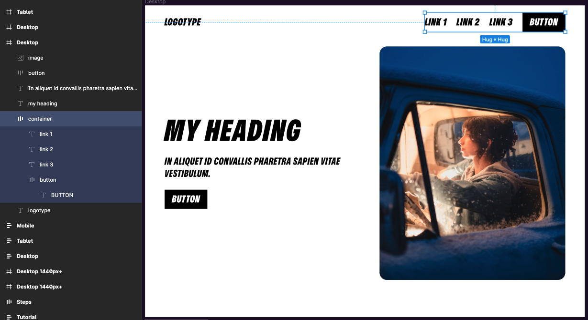

Then I'll take this `logo type` here and these items. I'll group this. Call this `navigation`.

> 

I'll take these text items here. I'll group these into another layout and call this `just container` again.

> 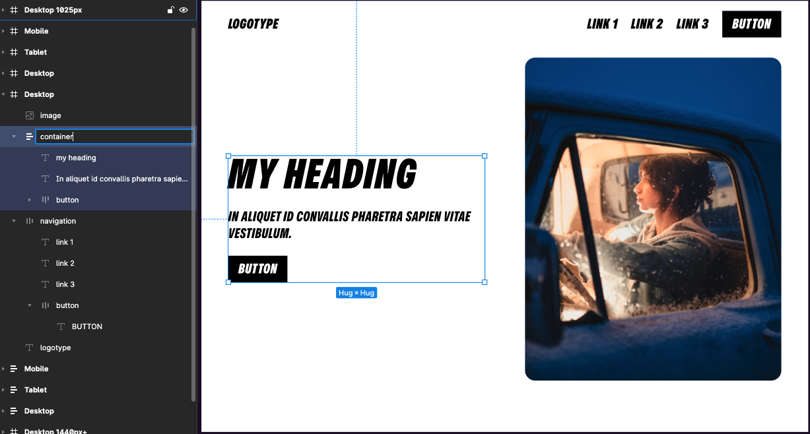

- And then I'll actually group these two here as well, so the image and the text container.
- So I'll group that and call that `hero content`
  

Now, if I start resizing this, `nothing happens` yet.

> 

- That's because a layout by itself doesn't help us achieve responsiveness. We need something else. We need `constraints`.

#### Creating Responsive Auto Layouts

- If I go into my `navigation` here, I'll target that.
- Well, the first thing I want to do is an `auto layout` change.
- Currently, we have spacing between the items here set to a fixed pixel value of 723.
  I want to change this to be spacing mode instead of `Auto`, which is the fixed value, to be spaced between.

  note: setting this will also set the horizontal resizing on the frame to `fixed`

> 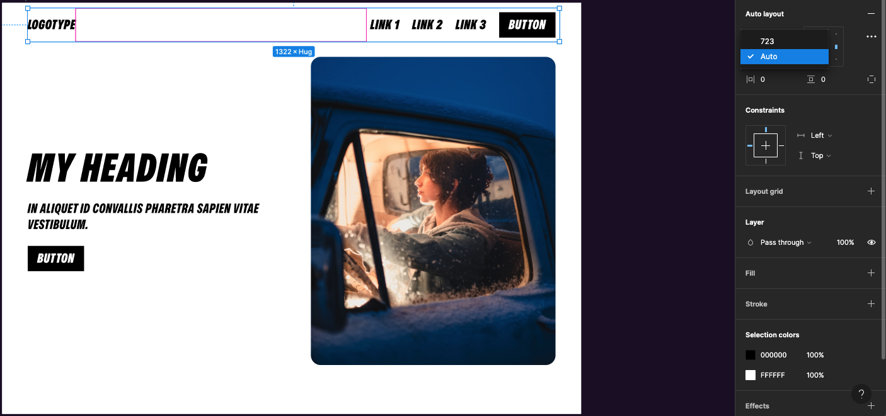

Now, this distance is not a hard-set value. Now, this distance is going to be automatic like this.

- So I change the width of this parent container, and everything inside will be dynamic.

> 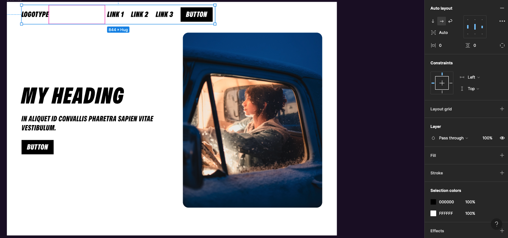

Still, though, if I change the size of this, nothing happens.

> 

- That's because we need to do some other stuff on top of this.

#### Using Constraints for Responsiveness

So we want to go to `constraints` here and change from left to `left and right`.

> 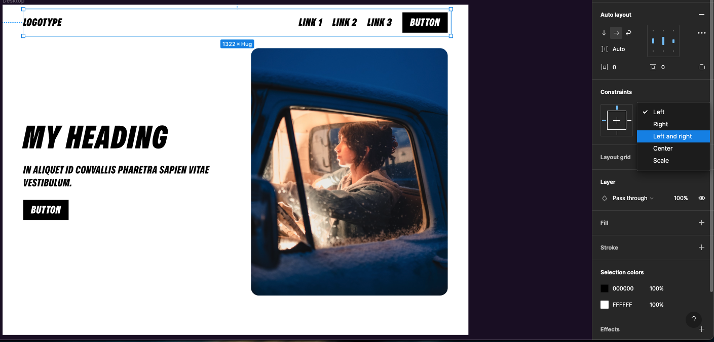

Now, if I grab our `desktop frame` here and I start resizing, now it's responsive.

> 

- Because now this `navigation container` here is holding on to each side, and it's going to stay responsive based on this `desktop frame's` width, just like that.
- Okay, Now the `nav bar` is responsive.

#### Fixing Hugging and Resizing

- Now I want to make these responsive here as well, the `hero container`

so we repeat the first 2 steps on the `hero container`

1. set the horizontal gap between items to `Auto`

> 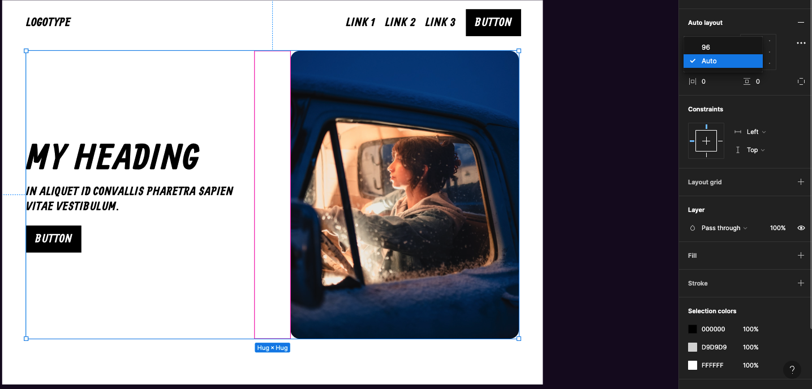

1. set the horizontal constrains to `Left and right`

> 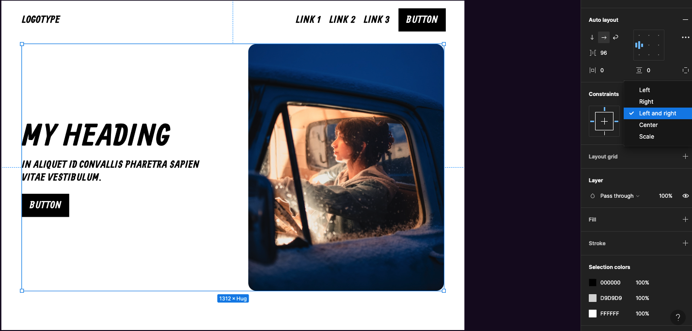

Now, if I change the size of `desktop` here, we see that the 2 hero elements overlap losing the gap and are not resizing.

> 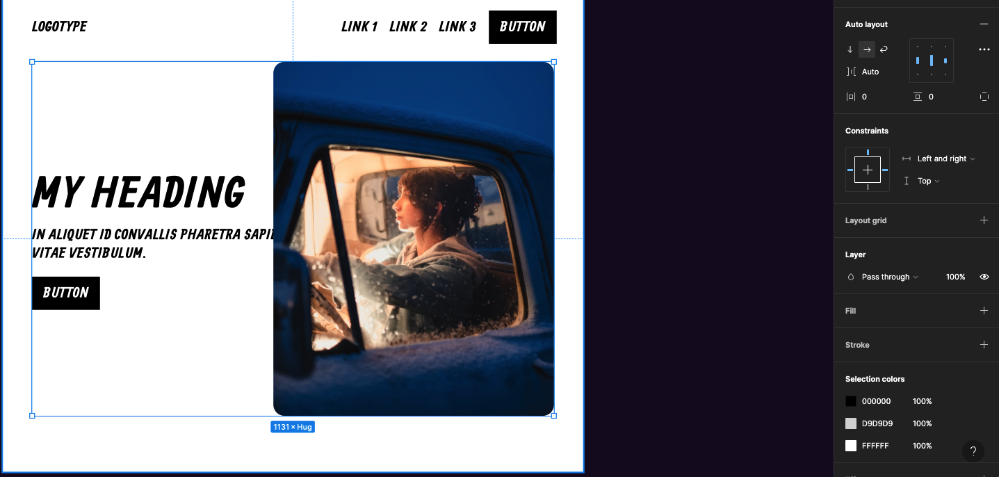

`this is what we want in our navigation but not on our hero`

- this is because the **text container** is set to `hug content` and the **text and image items** are set to `fixed width` and we need the things to be set to `fill container`.

so we set the **text container** from `hug` to `fill` under the frame section

> 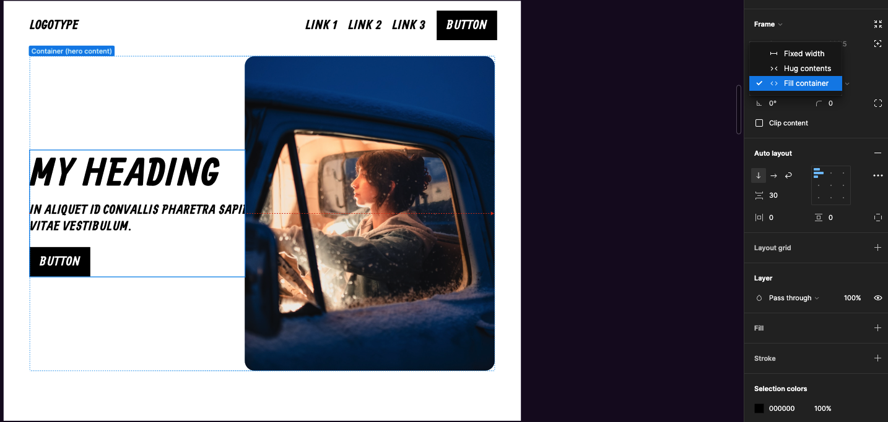

and we set the **text items** and the **image** from `fixed` to `fill`

**note**: the text items must be set to `fill` and `hug` to avoid vertical overlapping

> 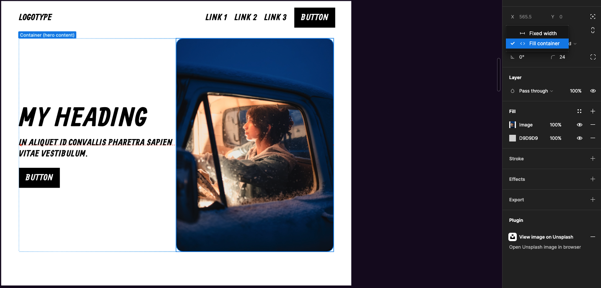

we can add the gap for the auto layout again to a size we think is beast

> 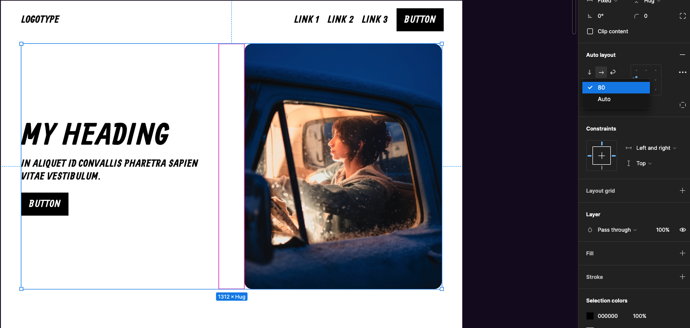

- If I change the size of it, you can see that it always takes up 50 percent of the space, and that's what `fill container` does in these cases.

- Now if I change everything here, you can see how it just works beautifully.
- So that's the way we get our responsive behavior to work inside of Figma.

### **=>** Step 2: Defining Breakpoints and Grids

- We're not quite yet done here. We need to do a couple of other things for it to be a true responsive layout.
- One of the things is to define our `breakpoints` and our `grids`.
- Our breakpoints aren't really just set to one static pixel value; we're working within ranges.

For `desktop`, we're gonna work with a range that is from `1025 pixels` and up.

For `tablet`, we're going to work from `1024 pixels` to `641`,

and for `mobile`, we're going to work from `640 pixels` to `0`.

> 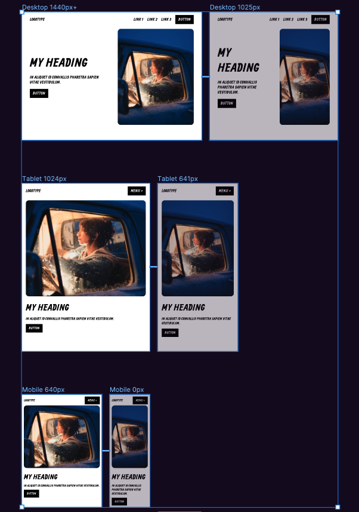

- All of these devices have their own ranges of pixels where they have the same kind of layout.
- So for `mobile` within this range, we're going to have the same structure. For `tablet` within this range (`1024` to `641`), we're gonna have the same layout. For anything above `1025`, we're going to have this specific `desktop` layout.
- The reason I have the `1440 pixel frame` here is because that's usually the size I'm working with, and this layout here is going to be the same for `2000 pixels` or anything above `1025`.
- I just have this reference frame of `1440` because, yeah, that's our main frame.
- With that in mind, we have our different breakpoint values.
- So, I know that I want a value for `1024`, which is going to be `tablet`. I know I want a value for `640`, which is where the `mobile` begins.

#### Creating Desktop Grids

- So if I take this `desktop frame` here and I start by adding grids.
- I'll add a `layout grid` here.
- I'll go and change from `grid` to `columns`.
- I'll change the `count` from `5` to `12`, which is the web standard.
- I'll change the `margin` to `64`, so the spacing from the sides here.
- I'll change the `gutter` to be `24 pixels`.
- Here we have our first grid for the `desktop`. Looks good.
- Now, usually, you would add a grid maybe as the first thing when you start creating a design because you want it as guidelines.
- But I'm just going to show you how we scale the grid for the different device sizes here.
- So we have the `desktop grid` set up, looks cool.
- Now, we can see that it's not actually mapping correctly. This container is not really mapping.
- So I want to map this exactly to the grid because if it's mapped to the grid when we start resizing stuff, these things are actually going to stay committed to the columns.
- They're now going to listen to the columns when we change sizes.
- Make sure everything is within the columns here, and it looks like it is. Cool.

#### Adjusting Grids for Tablet View

- So, then we have the first one. If I change this to `1440` again, it's still responsive. Cool.
- Now, duplicate this because for `tablet`, we have a very similar layout.
- I'll change this to be named `tablet`.
- I'll go into the `layout grid` here, change from `12 columns` to `8`.
- I'll change the margin to be `32 pixels`.
- You can see that, okay, so we changed the grid, but the content inside of here doesn't follow.
- So we have to realign stuff. I'll take this; I'll drag it to the side there and I'll increase the width.
- Do the same with this `nav bar` like that.
- And now, if we change the size, it still works. Cool.
- Now we want this to be `1024` in width, and there we have the layout.
- But not quite done because one thing I want to change for our `tablet`, and this is quite common when it comes to `tablet` views and `mobile` views, is that I want to stack my content differently.
- This is where `Auto Layout` once again is going to be very helpful for us.
- So I can go into my `hero content container` here, I can go to the `Auto Layout` settings and change to `Vertical Direction` instead of `horizontal direction`.
- You can see how it now stacks vertically. I'm not done there though. I want to change this image to be on the top instead, so I'll switch the order like that.
- Now it's starting to look more like the thing I want.
- So this is my `tablet view`. Now I'll grab the `tablet view`, duplicate that.

#### Creating Grids for Mobile View

- I'll go once again into my `layout grid`. I'll change the `count` to `4`, and I'll change the `margin` to `16 pixels`.
- This distance here in the sides is `16`, and the same with the `gutter`, it's going to be `16`.
- I'm gonna realign these again, make sure they stick to the sides of our columns like that.
- Realign this and change the size just like that.
- Change the whole width of this container or this `Frame` to `640`.
- And now I realize I forgot something for `tablet` and `mobile`. I actually want to hide those links.
- I want to change this to be some kind of a hamburger menu but that doesn't contain a hamburger. That just says `menu` like this, and plus.
- Okay, cool. So there we have our different layouts. Let's call this `mobile`, our different device sizes.

### **=>** Step 3: Sizing for Different Devices

- With all the grids set up with our different breakpoints, the last step I want to show you is how to size things differently for `desktop`, `tablet`, and `mobile`.

- A desktop is the main size here; we're not going to change that. So `tablet` will be the first size we change.
- You might be looking for some kind of a golden number here, like what multiple can I use when I change the sizes? There's no right answer; it depends on your layout and website.

- For this layout, I've used the same text size for a bunch of elements, so the logo type, menu text within the button, body text, and button text all have `32 pixels` in size.
- We're going to stay consistent; we're going to have the same change in size for these. I change these to maybe `28` for `tablet`, and then for the heading, I'll change it from `96 to `72`.

- Also, when it comes to changes in size for different devices, maybe we want to change the spacing.
- I'll change the spacing between the items in here to `24`.
- I'll change the spacing between the image and this text container to maybe be `64`.
- I'll change the spacing between this item here, the image, and the text to the top to be maybe `32`.
- And I think that looks fine; that's for `tablet`.

- Now, for `mobile`, I'm going to once again target all my text sizes to share the same text size.
- I'm going to go here, change from `32` to maybe `24`, and that looks fine.

- I'll change the heading from `96` to `56`.
- I'm going to change the spacing; maybe `16 pixels` spacing between those two, maybe `40 pixels`, or `48`.

- The spacing to the top here, maybe `24`, and this one to the outermost top is going to be `16`, like we have on the sides, and something like that.
- So now we've added all the different sizes.

- Now, if we look at the responsive behavior, it looks good here, looks good on `tablet`, and it looks good on `mobile`.

- If you want to become a real ninja in Figma, check out my master playlist on the topic

- Until the next one, have a great life! We'll talk soon. Ciao.
